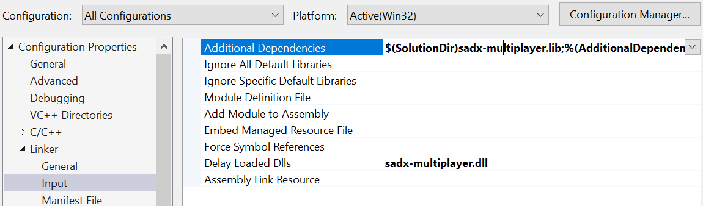

# Using the API

The Multiplayer mod exports a handful of functions to allow mod developpers to access and modify useful data. With these, you can access the rings of other players, the current screen being drawn to, etc.

There are two methods to get these exported functions: linking the import library and manually retrieving the function pointers. If you're unfamiliar with these, please read the tutorial for both methods before choosing.

## Manual method (function pointers)

This method requires setting up [function pointers](https://stackoverflow.com/a/840504) for each function you are going to use.

First, find the functions you're interested in [below](#Functions) and create a global function pointer for it. We will use "multi_score_add" and "multi_score_get" in this example.

```
void(*multi_score_add)(uint32_t pnum, int32_t amount) = nullptr;
int32_t(*multi_score_get)(uint32_t pnum) = nullptr;
```

Then, in your mod's Init function, we need to get a handle to the multiplayer mod and retrieve the needed functions. There are two methods to do that, the first one involves using the Mod Loader:

```
auto multi_mod = helperFunctions.Mods->find("sadx-multiplayer"); // Requires helperFunctions.Version >= 16
if (multi_mod)
{
	multi_score_add = multi_mod->GetDllExport<decltype(multi_score_add)>("multi_score_add");
	multi_score_get = multi_mod->GetDllExport<decltype(multi_score_get)>("multi_score_get");
	...
}
```

The second method involves using the Windows API:

```
HMODULE handle = GetModuleHandle(L"sadx-multiplayer.dll");
if (handle)
{
	multi_score_add = (void(*)(uint32_t pnum, int32_t amount))GetProcAddress(handle, "multi_score_add");
	multi_score_get = (int32_t(*)(uint32_t pnum))GetProcAddress(handle, "multi_score_get");
	...
}
```

You can now call the functions pointers, make sure they're not null

```
if (multi_score_add)
{
	multi_score_add(pnum, score);
}
```

## Automatic method (import library)

This method allows you to call all the API functions without function pointers, but requires some initial setup.

1. In the multiplayer mod's folder, copy `sadx-multiplayer.lib` and `multiapi.h` into your project folder.
2. Open your project settings and add `(ProjectDir)sadx-multiplayer.lib` to the additional dependencies.<br>You may adjust the relative path to where you put the files.
3. In "Delay Loaded Dlls", add `sadx-multiplayer.dll` (if you don't, people will need your mod to be loaded after the multiplayer mod.)



Now if you include `multiapi.h` in a cpp file you can call all the functions [below](#Functions) directly.

Be aware that if the multiplayer mod is not loaded, calling an API function will crash. You should check if the multiplayer mod is loaded before calling one of its function. I recommend making a global bool variable and initializing it in your mod's Init function. To check if the multiplayer mod exists you have two methods:
* `gMultiplayerModLoaded = helperFunctions.Mods->find("sadx-multiplayer") != nullptr` (requires helperFunctions.Version >= 16)
* `gMultiplayerModLoaded = GetModuleHandle(L"sadx-multiplayer.dll") != NULL;`

## Functions

### Gameplay

**multi_score_reset**
```
void multi_score_reset(void);
```
Reset the score counter of every player.

**multi_score_get**
```
int32_t multi_score_get(uint32_t pnum);
```
Get the current score of a specific player. Returns 0 for non-valid player IDs.

**multi_score_add**
```
void multi_score_add(uint32_t pnum, int32_t amount);
```
Add to the score of a specific player. No behaviour if you exceed the number of active players.

**multi_lives_reset**
```
void multi_lives_reset(void);
```
Reset the life counter of every player.

**multi_lives_get**
```
int32_t multi_lives_get(uint32_t pnum);
```
Get the current amount of lives of a specific player. Returns 0 for non-valid player IDs.

**multi_lives_add**
```
void multi_lives_add(uint32_t pnum, int32_t amount);
```
Add or remove lives for a specific player. No behaviour if you exceed the number of active players.

**multi_rings_reset**
```
void multi_rings_reset(void);
```
Reset the ring counter of every player.

**multi_rings_get**
```
int32_t multi_lives_get(uint32_t pnum);
```
Get the current amount of rings of a specific player. Returns 0 for non-valid player IDs.

**multi_rings_add**
```
void multi_rings_add(uint32_t pnum, int32_t amount);
```
Add or remove rings for a specific player. No behaviour if you exceed the number of active players.

**multi_get_winner**
```
int32_t multi_get_winner();
```
Get the player currently declared as the winner. This is only definitive once the result screen has appeared (battle mode.)

**multi_set_winner**
```
void multi_set_winner(uint32_t pnum);
```
Set the player that will be declared as the winner when the result screen appears (battle mode.)

**multi_get_enemy_list**
```
bool multi_get_enemy_list(uint32_t pnum, colaround** pp_ael, Uint16* p_num);
```
Retrieve array of nearby enemies for the given player. If the list exists, it returns true and write into provided pointers. On error, it returns false and does not write to any pointer. The count is optional as you can loop p_ael until twp is NULL.

**multi_get_ring_list**
```
bool multi_get_ring_list(uint32_t pnum, colaround** pp_arl, Uint16* p_num);
```
Retrieve array of nearby rings for the given player. If the list exists, it returns true and write into provided pointers. On error, it returns false and does not write to any pointer. The count is optional as you can loop p_arl until twp is NULL.

### System

**multi_is_enabled**
```
bool multi_is_enabled();
```
If multiplayer mod is enabled.

**multi_is_active**
```
bool multi_is_active();
```
If multiplayer mod is active (in game)

**multi_is_battle**
```
bool multi_is_battle();
```
Returns true if the current multiplayer mode is battle.

**multi_is_coop**
```
bool multi_is_coop();
```
Returns true if the current multiplayer mode is cooperation.

**multi_character_get**
```
int32_t multi_character_get(uint32_t pnum);
```
Returns the character ID for a specific player. `-1` means the character should not spawn or the player ID is invalid. Otherwise use the Characters enum provided by the Mod Loader.

**multi_character_set**
```
void multi_character_set(uint32_t pnum, int32_t character);
```
Set the character ID for a specific player. `-1` means the character should not spawn. Otherwise use the Characters enum provided by the Mod Loader.

**multi_enable**
```
void multi_enable(uint32_t player_count, bool battle);
```
Enable multiplayer mode. Other players will be loaded once ingame if they don't exist yet and have a character ID. To set one, use multi_set_charid.

**multi_disable**
```
void multi_disable();
```
Disable multiplayer mode, does not remove any loaded player.

**multi_get_player_count**
```
uint32_t multi_get_player_count();
```
Get the amount of multiplayer players (and not the number of loaded characters.)

### Fog

The fog system has been modified to allow per-player fog. By default, each player uses the global fog values. This is currently used for the Lost World mirror room.

**multi_set_fog**
```
void multi_set_fog(uint32_t pnum, ___stcFog* pFog);
```
Enable custom fog for a specific player. The player will no longer use the global fog until you use *multi_reset_fog*.

**multi_get_fog**
```
bool multi_get_fog(uint32_t pnum, ___stcFog* pFog);
```
If custom fog has been set for the given player, this returns true and writes data into pFog. If the player is using global fog, it returns false and does not write pFog. pFog can be null.

**multi_reset_fog**
```
void multi_reset_fog(uint32_t pnum);
```
Disable custom fog for the given player, effectively returning to global fog.

### Gravity

The gravity system has been modified to allow per-player gravity. By default, each player uses the global gravity. This is currently used for the Lost World gravity panels.

**multi_set_gravity**
```
void multi_set_gravity(uint32_t pnum, Angle angx, Angle angz);
```
Enable custom gravity for a specific player. The player will no longer use the global gravity until you use *multi_reset_gravity*.

**multi_get_gravity**
```
bool multi_get_gravity(uint32_t pnum, NJS_POINT3* v, Angle* angx, Angle* angz);
```
If custom gravity has been set for the given player, this returns true and writes data into all pointers. If the player is using global gravity, it returns false and does not write to any pointer. Individual pointers can be null.

**multi_reset_gravity**
```
void multi_reset_gravity(uint32_t pnum);
```
Disable custom gravity for the given player, effectively returning to global gravity.

### Camera

The camera system was entirely rewritten to support other screens. As such, I provide a multiplayer counterpart for most of the original game functions.

**camera_apply**
```
void camera_apply(uint32_t num);
```
Applies a specific camera view (projection, fov, etc.) to the current screen. You will probably never have to use this!

**camera_get_pos**
```
bool camera_get_pos(uint32_t num, NJS_POINT3* pos);
```
Returns a pointer to a specific camera position vector. All cameras are always accessible even if the player doesn't exist, so it will only return nullptr if the ID goes beyond 4.

**camera_get_ang**
```
Angle3* camera_get_ang(uint32_t num);
```
Returns a pointer to a specific camera rotation struct. All cameras are always accessible even if the player doesn't exist, so it will only return nullptr if the ID goes beyond 4.

**camera_set_pos**
```
void camera_set_pos(uint32_t num, float x, float y, float z);
```
Change the current position of a specific camera. No behaviour if the ID is beyond 4. Note that the camera position will most likely be overwritten by the current auto camera.

**camera_set_ang**
```
void camera_set_ang(uint32_t num, Angle x, Angle y, Angle z);
```
Change the current rotation of a specific camera. No behaviour if the ID is beyond 4. Note that the camera position will most likely be overwritten by the current auto camera.

**camera_get_fov**
```
uint32_t camera_get_fov(uint32_t num);
```
Get the field of view of a specific camera in Ninja Angle (0-0x10000).

**camera_set_fov**
```
void camera_set_fov(uint32_t num, Angle fov);
```
Set the field of view of a specific camera, it takes a Ninja angle (0-0x10000.) To reset, pass angle 0.

**camera_enable_freecam**
```
void camera_enable_freecam(uint32_t pnum, bool enable);
```
Enable/disable free camera mode for a specific screen.

**camera_is_freecam_enabled**
```
bool camera_is_freecam_enabled(uint32_t pnum);
```
Returns true if free camera mode is enabled for a specific player.

**camera_allow_freecam**
```
void camera_allow_freecam(uint32_t pnum, bool allow);
```
Allow/forbid free camera mode for a specific player.

**camera_is_freecam_allowed**
```
bool camera_is_freecam_allowed(uint32_t pnum);
```
Returns true if free camera is allowed for a specific player.

**camera_set_normal_camera**
```
void camera_set_normal_camera(uint32_t pnum, uint32_t ssCameraMode, uint32_t ucAdjustType);
```
Set the current auto camera for a specific player, will be overwritten as soon as you reach a camera layout trigger.

**camera_set_event_camera**
```
void camera_set_event_camera(uint32_t pnum, uint32_t ssCameraMode, uint32_t ucAdjustType);
```
Sets an event camera for a specific player. Event cameras can only be reset manually, or overwritten by another one.

**camera_set_event_camera_func**
```
void camera_set_event_camera_func(uint32_t pnum, CamFuncPtr fnCamera, uint32_t ucAdjustType, uint32_t scCameraDirect);
```
Sets an event camera for a specific player with a custom logic function. Event cameras can only be reset manually, or overwritten by another one.

**camera_release_event_camera**
```
void camera_release_event_camera(uint32_t pnum);
```
Release an event camera for a specific player if one is running.

### Split screen

**splitscreen_is_active**
```
bool splitscreen_is_active(void);
```
Returns true if split screen is currently active (in game).

**splitscreen_is_enable**
```
bool splitscreen_is_enable(void);
```
Returns true if split screen is enabled (not necessarily running).
For example, split screen is inactive during events, menus, etc.

**splitscreen_enable**
```
void splitscreen_enable(void);
```
Enable split screen (if the mod's config allows it.)
This is done automatically when multiplayer is enabled.

**splitscreen_disable**
```
void splitscreen_disable(void);
```
Disable split screen.
This is done automatically when multiplayer is disabled. You can use this if you need to disable split screen under certain conditions. Just remember to enable it back **if** it was previously enabled (see *splitscreen_is_enable*.)

**viewport_is_enabled**
```
bool viewport_is_enabled(int32_tnum);
```
Returns true if the given viewport / splitted-screen exists.

**viewport_set_num**
```
void viewport_set_num(int32_t num);
```
Set the viewport used for rendering models, sprites, etc. Set this to `-1` to render to the whole screen.

It is necessary to restore the previous viewport once you're done rendering things or you will break the queue. See *viewport_get_num*.

**viewport_get_num**
```
int32_t viewport_get_num(void);
```
Get the current viewport being drawn to.

Useful in the display subroutine of tasks to draw things only for specific players.

**viewport_get_info**
```
bool viewport_get_info(int32_t num, float* x, float* y, float* w, float* h);
```
Get the information of a specific split-screen. Returns true if the operation succeeded and values were written to. False otherwise.

### Menu / UI

**multi_replace_text**
```
void multi_replace_text(const char* name, uint32_t language, const char* text);
```

Change text added by the multiplayer mod. The `\a` prefix centers text. This can be useful for translation mods.

List of added strings:
* "stage_confirm" = "\aDo you want to play this stage?"
* "press_start" = "\aPress start to join"