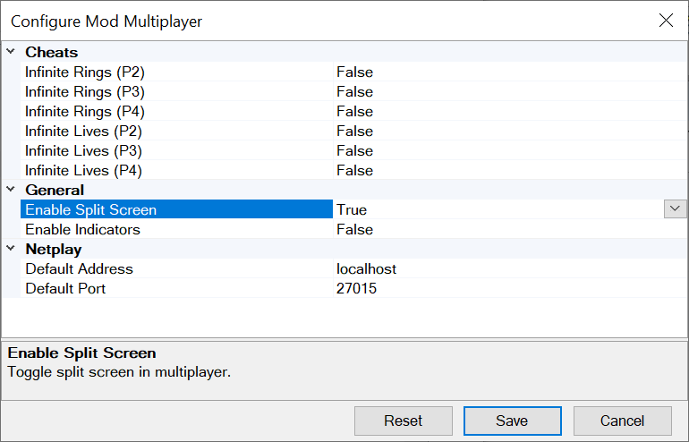

# Using the mod

## Installing

You need the following pre-requisites:
* The [SADX Mod Loader](https://github.com/X-Hax/sadx-mod-loader) ([installer version](https://sadxmodinstaller.unreliable.network/))
* The [Microsoft Visual C++ Redistributable for Visual Studio 2022 (**x86**)](https://aka.ms/vs/16/release/vc_redist.x86.exe) (auto-installed by the installer)

If you have them:
1. Download the mod archive from [here](https://github.com/kellsnc/sadx-multiplayer/releases/latest).
2. Open the archive and drop the "sadx-multiplayer" folder into your "mods" folder.
3. Open the Mod Manager and enable the mod.

## Configuration



The multiplayer mod comes with a few options that you can access by using the "Configure" button in the Mod Manager.

You can also configure the mod manually by creating/editing `config.ini` in the mod's folder.

Here is a config file with all the options and their default values:
```
SplitScreen=True ; Enable split screen in multiplayer.
HorizontalLayout=False ; Split screen horizontally in two-player mode.
Indicator=False ; Enable positional indicators in multiplayer.

[Cheats]
InfiniteRingsP1=False ; Enable infinite rings for P1 (same as enabling the Infinite Rings cheat code)
InfiniteRingsP2=False ; Enable infinite rings for P2
InfiniteRingsP3=False ; Enable infinite rings for P3
InfiniteRingsP4=False ; Enable infinite rings for P4
InfiniteLivesP1=False ; Enable infinite lives for P1 (same as enabling the Infinite Lives cheat code)
InfiniteLivesP2=False ; Enable infinite lives for P2
InfiniteLivesP3=False ; Enable infinite lives for P3
InfiniteLivesP4=False ; Enable infinite lives for P4

[Netplay]
DefaultAddress=localhost ; The address already filled in when you open the menu
DefaultPort=27015 ; The port already filled in when you open the menu
```

## How to use

In the main menu you should see a newly added "Multiplayer" button. If it is disabled, it means you have not yet completed a level in this save file. For the moment, only local multiplayer is supported.

Once in the multiplayer menu, choose between:
* Co-op: you can choose any character you want, lives are shared, you can't hit anyone and you win together.
* Battle: the character type is forced, you can hit your opponents and access Twinkle Circuit.

Then choose the gameplay type and level to play together!

### Free Camera

Individual players are able to switch their camera mode by holding L+R and then pressing Y.

### Fishing with Big

Lure a fish until it bites and when it does, move the left stick around.

Objectives:
* In co-op mode you must catch Froggy
* In battle mode, the first one to reach 2000g wins